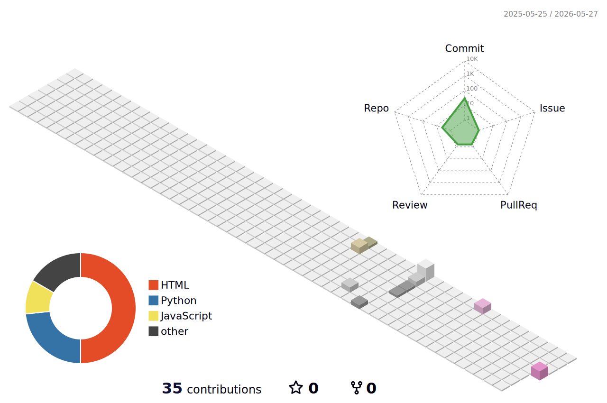

  

  

  
  
  

 

  
  
  
  

---

## 🚀 About Me

Computer Science undergraduate specializing in IoT and Embedded Systems with hands-on experience building ESP32 and ESP8266 based solutions. I love to make dead hardware come alive with a few lines of code! ⚡

- 🔭 **I’m currently working on:** IoT solutions and Robotics hardware (ESP32, ESP8266, Arduino)
- 🌱 **I’m currently learning:** Advanced Embedded Linux, RTOS, and Industrial Automation (IIoT)
- 👯 **I’m looking to collaborate on:** Open-source IoT projects, firmware libraries, and hardware integrations
- 💬 **Ask me about:** C/C++, ESP-IDF, ESP-NOW, Sensors Integration, and Microcontroller Interfacing

---

## 🛠 Tech Focus & Skills

**Languages & Core Tech:** 
<code></code>
<code></code>
<code></code>
<code></code>
<code></code>
<code></code>

**Hardware & Microcontrollers:** 
<code></code>
<code></code>
<code></code>
<code></code>

**Tools & Frameworks:** 
<code></code>
<code></code>
<code></code>
<code></code>
<code></code>
<code></code>

 

**Sensors & Actuators:** 

 

**Protocols:** 

---

## 📂 Featured Projects

### 🔹 ESP-NOW Temperature & Humidity System

Distributed sensor network with master nodes acquiring DHT11 data and transmitting it to a slave node via ESP-NOW, with real-time local web server broadcasting.

  
  
  

### 🔹 KME-Smart Home Automation

Configured and flashed custom firmware on ESP8266 to enable remote appliance control via Wi-Fi and real-time environment monitoring through a mobile application.

  
  
  

### 🔹 Line Following Robotic Car

Developed a line-following car utilizing an IR sensor array to detect black line trajectories with a custom PID controller implementation.

  
  
  

### 🔹 Magic Image Compressor

A full-stack web application for image compression utilizing Python's Pillow library.

  
  
  

### 🔹 EduStream Course Platform with LMS

A modern Learning Management System built with Django REST framework and React.

  
  
  

---

## 🌳 GitHub Contribution Graph

  

---

## 🏆 GitHub Streak Stats

  

---

## ⚡ Recent GitHub Activity
<!--START_SECTION:activity-->
1. 🎉 Created repository [ShyamHirpara/ShyamHirpara](https://github.com/ShyamHirpara/ShyamHirpara)
2. 🚀 Pushed to [ShyamHirpara/EduStream-Course-Platform-with-LMS](https://github.com/ShyamHirpara/EduStream-Course-Platform-with-LMS)
3. 🌟 Starred [rzashakeri/beautify-github-profile](https://github.com/rzashakeri/beautify-github-profile)
4. 🔨 Pushed to [ShyamHirpara/COMPRESSOR](https://github.com/ShyamHirpara/COMPRESSOR)
5. 🤖 Created repository [ShyamHirpara/Line-Following-Robotic-Car](https://github.com/ShyamHirpara/Line-Following-Robotic-Car)
<!--END_SECTION:activity-->

---

## 📫 Connect

  
  

